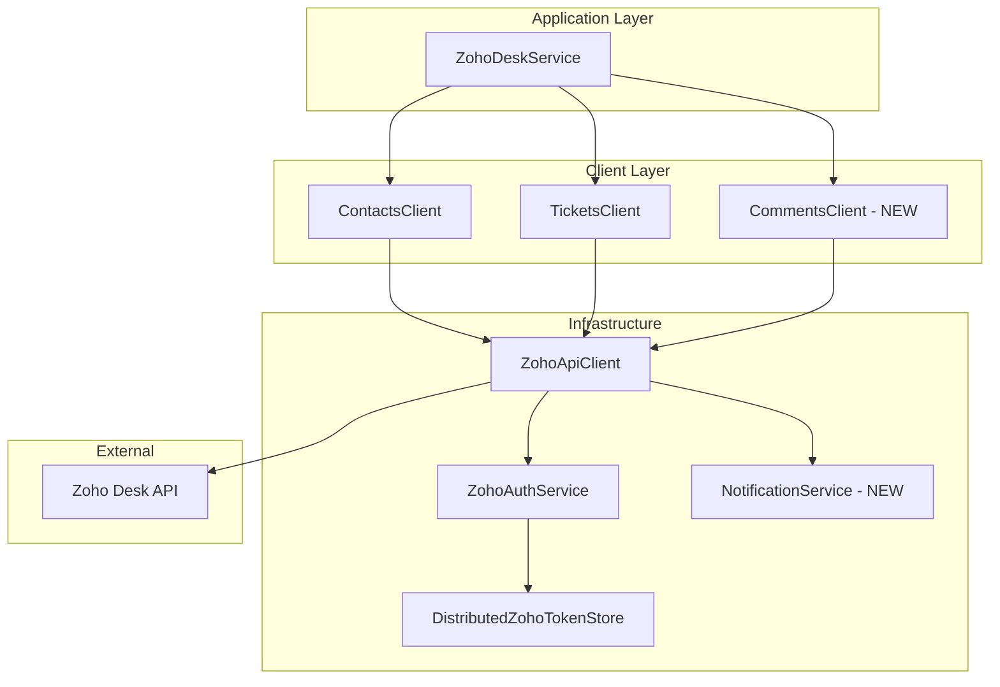

# Zoho Desk Integration - Refactoring and Implementation Plan

## Executive Summary

This plan outlines the refactoring of the existing Zoho Desk integration module and implementation of missing features based on the requirements in `Zoho HelpDesk.docx` and API documentation in `API.txt`.

---

## Current Implementation Analysis

### ✅ Already Implemented

| Feature | Status | Location |
|---------|--------|----------|
| OAuth 2.0 Authentication | ✅ Complete | [`ZohoAuthService.cs`](ZohoDesk/Services/ZohoAuthService.cs) |
| Token Storage (Distributed Cache) | ✅ Complete | [`DistributedZohoTokenStore.cs`](ZohoDesk/Authentication/DistributedZohoTokenStore.cs) |
| Auto Token Refresh on 401 | ✅ Complete | [`ZohoApiClient.cs`](ZohoDesk/Clients/ZohoApiClient.cs:96-110) |
| Retry Logic (5xx, 429) | ✅ Complete | [`ZohoApiClient.cs`](ZohoDesk/Clients/ZohoApiClient.cs:112-130) |
| Create Contact | ✅ Complete | [`ContactsClient.cs`](ZohoDesk/Clients/ContactsClient.cs:39-59) |
| Search Contact by Email | ✅ Complete | [`ContactsClient.cs`](ZohoDesk/Clients/ContactsClient.cs:21-37) |
| Create Ticket | ✅ Complete | [`TicketsClient.cs`](ZohoDesk/Clients/TicketsClient.cs:21-41) |
| Update Ticket | ✅ Complete | [`TicketsClient.cs`](ZohoDesk/Clients/TicketsClient.cs:43-65) |
| Basic Logging | ✅ Complete | Throughout all clients and services |
| Configuration Options | ✅ Complete | [`ZohoDeskOptions.cs`](ZohoDesk/Options/ZohoDeskOptions.cs), [`RetryOptions.cs`](ZohoDesk/Options/RetryOptions.cs) |
| DI Registration | ✅ Complete | [`ServiceCollectionExtensions.cs`](ZohoDesk/Infrastructure/ServiceCollectionExtensions.cs) |

### ❌ Missing Features

| Feature | Priority | Description |
|---------|----------|-------------|
| Ticket Comments API | High | Add comments to tickets |
| Search Contacts Enhancement | Medium | Support additional search parameters |
| Notification on Failed Retries | Medium | Notify developer after 3 failed attempts |
| Enhanced Logging | Low | Include User ID in logs |

---

## Issues Found in Current Implementation

### 1. Search Response Model Mismatch

**Problem:** The API returns search results in a different format:
```json
{
  "data": [ { ... contact objects ... } ],
  "count": 1
}
```

**Current Code:** [`ContactsClient.FindByEmailAsync()`](ZohoDesk/Clients/ContactsClient.cs:21-37) expects a single `Contact` object instead of a search result wrapper.

**Impact:** Search functionality will fail to deserialize properly.

### 2. Incorrect Comments Endpoint

**Problem:** Requirements document states:
```
POST https://desk.zoho.com/api/v1/tickets/{ticket_id}/message
```

**API Documentation shows:**
```
POST api/v1/tickets/{ticket_id}/comments
```

**Resolution:** Use the correct endpoint `/api/v1/tickets/{ticket_id}/comments`

### 3. Missing Notification Mechanism

**Problem:** Requirements specify:
> После 3 неудач → уведомить разработчика (в лог / Telegram)

**Current State:** Only logs warning, no notification mechanism.

### 4. Incomplete Logging Context

**Problem:** Requirements specify logging should include:
- Время запроса ✅
- URL и метод ✅
- Статус ответа ✅
- User ID (если есть) ❌
- Текст ошибки ✅

---

## Refactoring Plan

### Phase 1: Fix Critical Issues

#### 1.1 Fix Search Contacts Response Model

Create new DTOs for search results:

```csharp
// ZohoDesk/DTO/ContactsSearchResult.cs
public sealed class ContactsSearchResult
{
    [JsonPropertyName("data")]
    public List<Contact>? Data { get; init; }
    
    [JsonPropertyName("count")]
    public int Count { get; init; }
}
```

Update [`IContactsClient`](ZohoDesk/Clients/IContactsClient.cs):
```csharp
Task<ContactsSearchResult?> SearchByEmailAsync(
    string email,
    CancellationToken cancellationToken = default);
```

#### 1.2 Update ContactsClient Implementation

Modify [`FindByEmailAsync`](ZohoDesk/Clients/ContactsClient.cs:21-37) to:
- Return `ContactsSearchResult`
- Add helper method `GetFirstContactByEmailAsync` for convenience

---

### Phase 2: Implement Missing Features

#### 2.1 Ticket Comments API

**New Files:**

```
ZohoDesk/
├── DTO/
│   ├── TicketComment.cs           # Response model
│   └── CreateTicketCommentRequest.cs  # Request model
├── Clients/
│   ├── ICommentsClient.cs         # Interface
│   └── CommentsClient.cs          # Implementation
```

**DTOs:**

```csharp
// ZohoDesk/DTO/CreateTicketCommentRequest.cs
public sealed class CreateTicketCommentRequest
{
    [JsonPropertyName("content")]
    public string Content { get; init; } = string.Empty;
    
    [JsonPropertyName("isPublic")]
    public bool IsPublic { get; init; } = true;
    
    [JsonPropertyName("contentType")]
    public string ContentType { get; init; } = "html";
    
    [JsonPropertyName("attachmentIds")]
    public List<string>? AttachmentIds { get; init; }
}

// ZohoDesk/DTO/TicketComment.cs
public sealed class TicketComment
{
    [JsonPropertyName("id")]
    public string Id { get; init; } = string.Empty;
    
    [JsonPropertyName("content")]
    public string? Content { get; init; }
    
    [JsonPropertyName("isPublic")]
    public bool IsPublic { get; init; }
    
    [JsonPropertyName("contentType")]
    public string? ContentType { get; init; }
    
    [JsonPropertyName("commentedTime")]
    public DateTimeOffset? CommentedTime { get; init; }
    
    [JsonPropertyName("commenterId")]
    public string? CommenterId { get; init; }
    
    [JsonPropertyName("commenter")]
    public Commenter? Commenter { get; init; }
    
    [JsonPropertyName("attachments")]
    public List<CommentAttachment>? Attachments { get; init; }
}
```

**Interface:**

```csharp
// ZohoDesk/Clients/ICommentsClient.cs
public interface ICommentsClient
{
    Task<TicketComment?> CreateAsync(
        string ticketId,
        CreateTicketCommentRequest request,
        CancellationToken cancellationToken = default);
}
```

**Routes Update:**

```csharp
// ZohoDesk/Infrastructure/ZohoRoutes.cs - Add method
public static string TicketComments(string ticketId)
    => $"{ApiVersion}/tickets/{Uri.EscapeDataString(ticketId)}/comments";
```

#### 2.2 Enhanced Search Contacts

Add optional parameters to search:

```csharp
Task<ContactsSearchResult?> SearchAsync(
    string? email = null,
    string? phone = null,
    string? firstName = null,
    string? lastName = null,
    int limit = 10,
    int from = 0,
    CancellationToken cancellationToken = default);
```

#### 2.3 Notification System

**New Interface:**

```csharp
// ZohoDesk/Services/INotificationService.cs
public interface INotificationService
{
    Task NotifyFailureAsync(
        string message,
        Exception? exception = null,
        CancellationToken cancellationToken = default);
}
```

**Implementations:**

1. `LogNotificationService` - Default, logs errors
2. `TelegramNotificationService` - Optional, sends to Telegram

**Configuration:**

```csharp
// ZohoDesk/Options/NotificationOptions.cs
public sealed class NotificationOptions
{
    public bool Enabled { get; init; } = true;
    public string? TelegramBotToken { get; init; }
    public string? TelegramChatId { get; init; }
}
```

**Integration Point:**

Update [`ZohoApiClient.ExecuteAsync`](ZohoDesk/Clients/ZohoApiClient.cs:63-133) to call notification service after all retries exhausted.

---

### Phase 3: Code Quality Improvements

#### 3.1 Enhanced Logging with User Context

Create logging context:

```csharp
// ZohoDesk/Infrastructure/LogContext.cs
public static class LogContext
{
    public static readonly AsyncLocal<string?> CurrentUserId = new();
}
```

Update [`ZohoApiClient`](ZohoDesk/Clients/ZohoApiClient.cs) to include User ID in logs.

#### 3.2 Consistent XML Documentation

Add comprehensive XML docs to all public APIs.

#### 3.3 Input Validation

Add data annotations to request models:

```csharp
public sealed class CreateTicketCommentRequest
{
    [Required]
    [MaxLength(32000)]
    public string Content { get; init; } = string.Empty;
    
    public bool IsPublic { get; init; } = true;
    
    [MaxLength(100)]
    public string ContentType { get; init; } = "html";
}
```

---

## Architecture Diagram



---

## Implementation Order

### Step 1: Fix Search Response Model
- Create `ContactsSearchResult` DTO
- Update `IContactsClient` interface
- Update `ContactsClient` implementation
- Update `ZohoDeskService` to use new search result

### Step 2: Implement Comments API
- Create `CreateTicketCommentRequest` DTO
- Create `TicketComment` DTO
- Create `Commenter` and `CommentAttachment` DTOs
- Add `TicketComments` route to `ZohoRoutes`
- Create `ICommentsClient` interface
- Implement `CommentsClient`
- Register in DI container

### Step 3: Add Notification System
- Create `INotificationService` interface
- Implement `LogNotificationService`
- Add `NotificationOptions`
- Integrate with `ZohoApiClient`

### Step 4: Enhanced Search
- Add search parameters to `IContactsClient`
- Update `ContactsClient` with new search options
- Add route builder for search query

### Step 5: Enhanced Logging
- Add `LogContext` for User ID
- Update logging in `ZohoApiClient`

### Step 6: Documentation and Validation
- Add XML documentation
- Add data annotations
- Add validation in request handlers

---

## Files to Create

| File | Purpose |
|------|---------|
| `ZohoDesk/DTO/ContactsSearchResult.cs` | Search response wrapper |
| `ZohoDesk/DTO/CreateTicketCommentRequest.cs` | Comment creation request |
| `ZohoDesk/DTO/TicketComment.cs` | Comment response model |
| `ZohoDesk/DTO/Commenter.cs` | Comment author details |
| `ZohoDesk/DTO/CommentAttachment.cs` | Comment attachment |
| `ZohoDesk/Clients/ICommentsClient.cs` | Comments client interface |
| `ZohoDesk/Clients/CommentsClient.cs` | Comments client implementation |
| `ZohoDesk/Services/INotificationService.cs` | Notification interface |
| `ZohoDesk/Services/LogNotificationService.cs` | Default logger implementation |
| `ZohoDesk/Options/NotificationOptions.cs` | Notification configuration |
| `ZohoDesk/Infrastructure/LogContext.cs` | Logging context helper |

## Files to Modify

| File | Changes |
|------|---------|
| `ZohoDesk/Clients/IContactsClient.cs` | Update search method signature |
| `ZohoDesk/Clients/ContactsClient.cs` | Implement new search logic |
| `ZohoDesk/Infrastructure/ZohoRoutes.cs` | Add comments route |
| `ZohoDesk/Clients/ZohoApiClient.cs` | Add notification integration |
| `ZohoDesk/Services/ZohoDeskService.cs` | Use new search result type |
| `ZohoDesk/Infrastructure/ServiceCollectionExtensions.cs` | Register new services |
| `ZohoDesk/Options/ZohoDeskOptions.cs` | Add notification options |

---

## Testing Recommendations

1. **Unit Tests** for all new clients and services
2. **Integration Tests** with Zoho API sandbox
3. **Mock HTTP** for testing retry logic
4. **Test Cases:**
   - Contact search with no results
   - Contact search with multiple results
   - Comment creation with mentions
   - Retry exhaustion notification
   - Token refresh on 401

---

## Acceptance Criteria

- [ ] Module authorizes with Zoho Desk API
- [ ] Can create contact and ticket
- [ ] Can update existing ticket
- [ ] Can add comments to tickets
- [ ] All requests are logged with full context
- [ ] Errors handled with retries
- [ ] Notifications sent after failed retries
- [ ] Search contacts returns correct results
